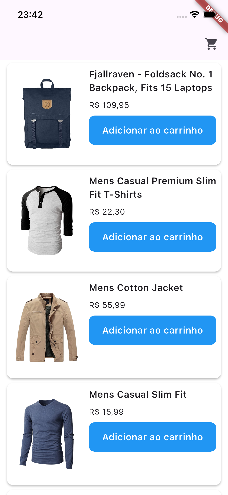
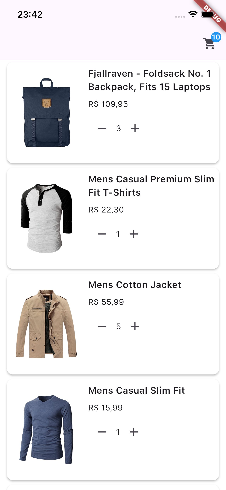
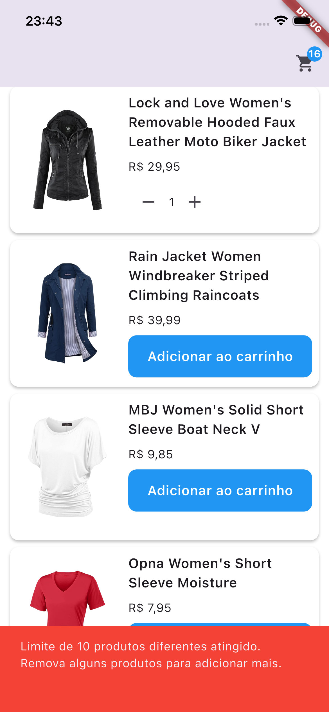
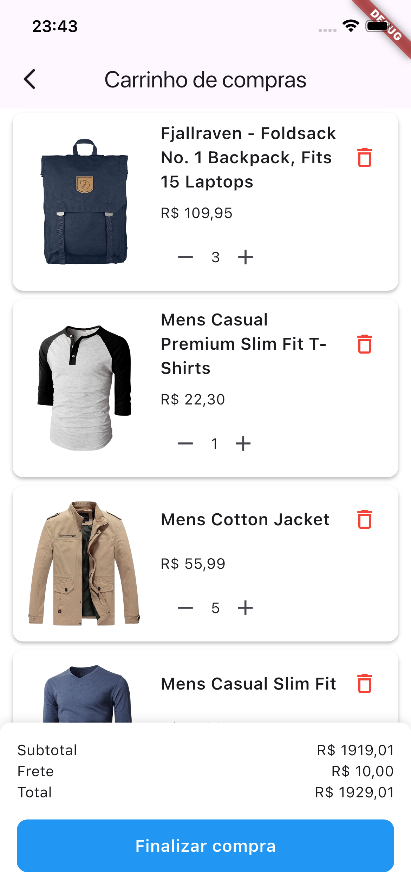
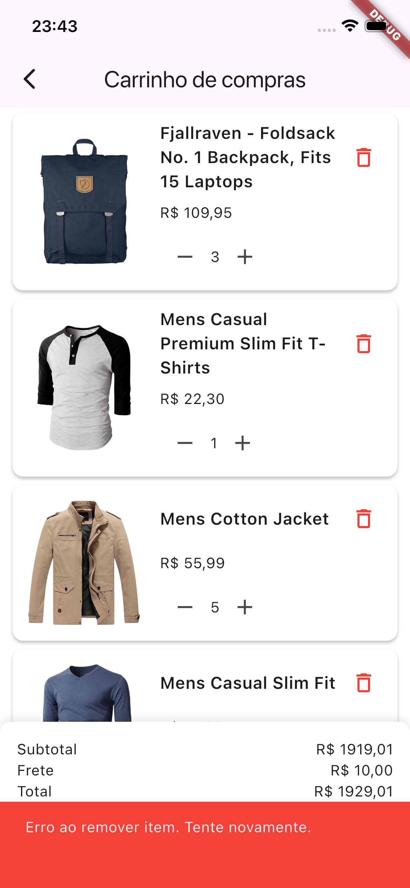
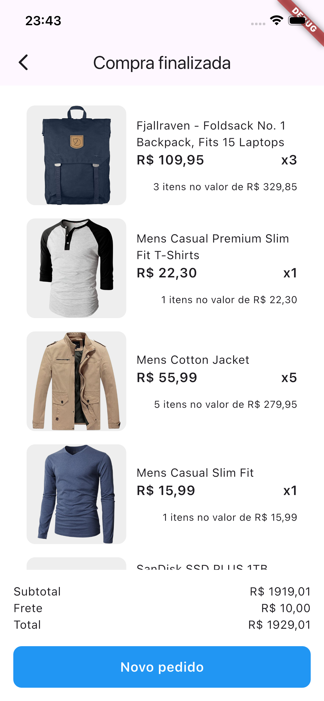

# Shopping Cart - Flutter MVVM

Aplicação de carrinho de compras desenvolvida em Flutter seguindo a arquitetura MVVM.

[](https://www.linkedin.com/in/renansantosbr)

## 📋 Requisitos

- Flutter 3.38.3
- Dart 3.10.1

## 🚀 Como executar

```bash
# Instalar dependências
flutter pub get

# Executar o app
flutter run

# Rodar testes
flutter test
```

## 🏗️ Arquitetura

O projeto segue a arquitetura **MVVM (Model-View-ViewModel)** com separação clara de responsabilidades:

- **Model**: Entidades de domínio (`Product`, `Cart`, `CartItem`)
- **View**: Widgets de UI que apenas renderizam (recebem dados via props e emitem callbacks)
- **ViewModel**: Orquestra fluxo de dados e gerencia estado da UI
- **Use Cases**: Contém toda a lógica de negócio isolada e testável
- **Repository**: Abstração para acesso a dados (API, cache, etc)
- **Data**: Implementações dos repositories e DTOs

## 🛠️ Tecnologias

- **Flutter** - Framework UI
- **Provider** - Gerenciamento de estado com ChangeNotifier
- **Dio** - Cliente HTTP
- **Mockito** - Testes unitários
- **FakeStore API** - API de produtos

## ✨ Funcionalidades

- ✅ Listagem de produtos da API
- ✅ Adicionar produtos ao carrinho
- ✅ Incrementar/decrementar quantidade
- ✅ Remover produtos do carrinho
- ✅ Limite de 10 produtos diferentes
- ✅ Cálculo de subtotal e total
- ✅ Finalização de pedido
- ✅ Estados de loading e erro

## 📱 Screenshots

<div align="center">
  
  
  
</div>

<div align="center">
  
  
  
</div>

## 📂 Estrutura de Pastas

```
lib/
├── core/              # Configurações, constantes e utils
├── data/              # Repositories e DTOs
├── domain/
│   ├── models/        # Entidades de domínio
│   └── usecases/      # Casos de uso (lógica de negócio)
├── viewmodels/        # Gerenciamento de estado
├── views/             # Telas e widgets
└── shared/            # Widgets reutilizáveis
```

## 📝 Padrões Aplicados

### Result Pattern

Tratamento de erros type-safe usando sealed classes. Em vez de try/catch, as operações retornam `Result<T>` que pode ser `Ok` ou `Error`. Isso torna o fluxo de erro explícito e obriga a tratar todos os casos.

### Use Cases

A lógica de negócio fica isolada em casos de uso específicos, deixando os ViewModels apenas orquestrando o fluxo. Cada use case faz uma coisa só e é facilmente testável.

- `AddItemToCartUseCase` - Valida limite e adiciona produtos
- `UpdateItemQuantityUseCase` - Incrementa/decrementa quantidades

### Outros

- **Repository Pattern** - Abstração da camada de dados
- **Dependency Injection** - Provider para injeção de dependências
- **Immutability** - Modelos imutáveis com copyWith
- **SOLID** - Separação clara de responsabilidades

## 🧪 Testes

Os teste implementados foram:

- Testes unitários para ViewModels **HomeViewmodel**

## 📝 Observações

Foi implementado apenas o teste unitário do **HomeViewModel**, faltando:

- Testes unitários dos outros ViewModels (CartStoreViewmodel)
- Testes unitários dos Use Cases (AddItemToCartUseCase, UpdateItemQuantityUseCase)
- Testes de widget com pump verificando renderização por estado (loading, erro, sucesso)
